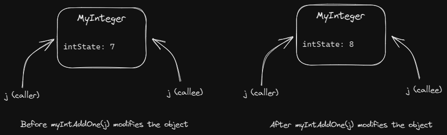
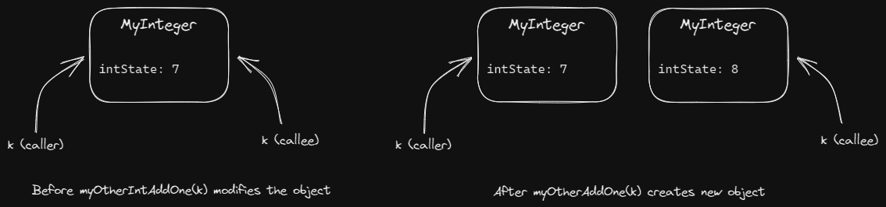
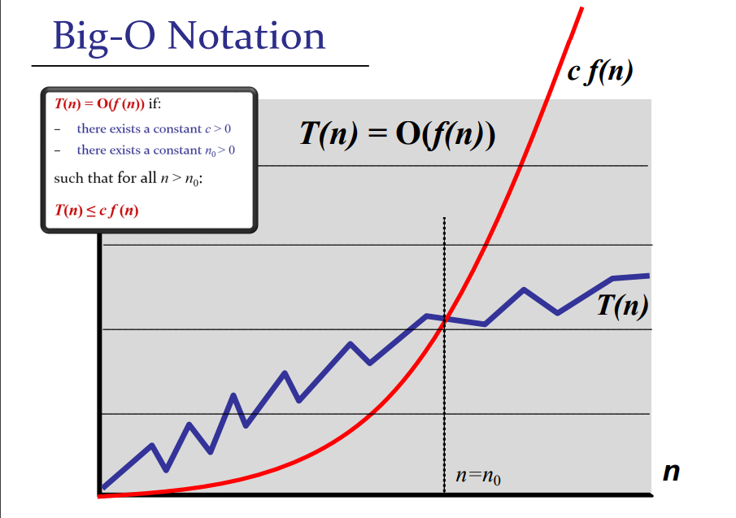
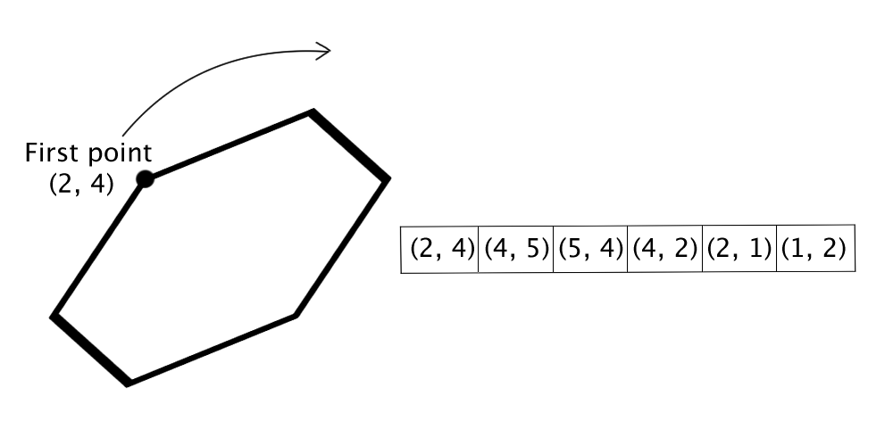

<style>
  @import url('https://fonts.googleapis.com/css2?family=Open+Sans:ital,wght@0,400;0,700;1,400;1,700&display=swap');

  section {
    font-family: 'Open Sans'
  }
</style>

<!-- backgroundColor: #191919 -->

# CS2040S Tutorial 1

Group T40

Week 3

---

# Admin

---

# Tutorial
- Experience will be awarded for **preparation** and **participation**
- Expectation: attempt tutorial beforehand
- Usual flow:
  - Sit in groups (5 people/group)
  - Discuss selected problems
  - Present solution
    - Goal: convince people that your solution is correct
    - Even if you do not have the full solution, it's alright
- Slides will be uploaded after class
  - Most likely at [dystoriax.github.io/cs2040s-ta](dystoriax.github.io/cs2040s-ta)

---
# PS
- <span style="color: #ff6961">Important:</span> Submit before the deadline!
  - Penalty will be applied
  - Extension will be granted on a case-by-case basis
- Adhere to standard style guide
- Write clean code (at least readable)
- Write comments on your algorithm
  - _If other person read this code, is it easy to understand/clear?_
- [Write-up](dystoriax.github.io/cs2040s-ta) will be provided as supplementary material
  - Released after everyone have submitted their work
- If it is not graded within 4 days, remind me :(
- If you have any dispute, let me know

---

# Misc

- If you have any questions, just ask!
  - Telegram
  - Book Consultation
- But not on weekend, please... :)
  - No promise

---

# Ice Breaker

---

# Picture of The Day


---

# Tutorial

---

# Problem 1: Java Review

---

# Part (a)

What is the difference between a class and an object? Illustrate with an example.

---

# Solution

A class acts as a 'blueprint', i.e. the structure of an object. An object is the real manifest of the class itself (i.e. the value).

Example: you can say that a human has a name and age. That is the class specification. The real human itself has its own concrete _value_ for the name and age.

---

# Example

```java
class Human {
  // declares that any human has name and age, but not specific values
  private String name;
  private int age;

  public Human(String name, int age) {
    this.name = name;
    this.age = age;
  }
}

Human anya = Human("Anya Forger", 6); // initialize object; giving values!
```

---

# Part (b)

Why does the `main` method come with a `static` modifier?

---

# Solution

Java program’s `main` method has to be declared `static` because the keyword `static` allows `main` to be called without creating an object of the class in which the `main` method is defined. If we omit the `static` keyword before `main`, Java program will successfully compile but it won’t execute.

---

# Part (c)

Give an example class (or classes) that uses the modifier `private` incorrectly (i.e. the program will not compile as it is, but would compile if `private` was changed to `public`)

---
# Solution

```java
class A {
  private int a; // change this to public

  public A(int a) {
    this.a = a;
  }
}

class Main {
  public static void main(String args[]) {
    A a = new A(10);

    System.out.println(A.a); // error, but compiles if changed to public!
  }
}
```

More about this on CS2030S :)

---
# Part (d)

The following questions is about interfaces

1. Why do we use interfaces
2. Give an example of using an interface
3. Can a method return an interface?

---
# Solution

1. We use interface to create a "contract" of what an object is able to do. This is useful in design stage where we are only concerned with high level of what this object _can do_.
2. PS1 :)
3. Yes

Extra reference: [The Flaws of Inheritance](https://www.youtube.com/watch?v=hxGOiiR9ZKg)

---
# Part (e)

Refer to `IntegerExamination.java`.  Without running the code, predict the output of the `main` method. Explain.

---
# Demo

```sh
javac IntegerExamination.java
java IntegerExamination
```

---
# Solution

```java
  static public void addOne(int i) { // (2)
    i = i + 1;
    System.out.println("I am in addOne. The value of i is " + i);
  }

  // ...
    int i = 0; // (1)
    addOne(i);
```

`int` is a primitive type. When `addOne()` is called, the argument value `i` (1) is copied
over as the function's parameter value `i` (2). Therefore, modification inside the
function does not affect the value of `i` from the caller (1).

---

# Solution (cont.)

```java
  static public void myIntAddOne(MyInteger j) { // (2)
    j.intState = j.intState + 1;
    System.out.println("I am in myIntAddOne. The value of j is " + j);
  }

  // ...
    MyInteger j = new MyInteger(7); // (1)
    myIntAddOne(j);
```

`MyInteger` is a reference type. When `myIntAddOne()` is called, the argument value `j`
(1) is **not** copied over to the function's parameter `j` (2). They refer to the same object.
Hence, modification of internal values of the object by the function affect the value
of `j` from the caller (1)

---

# Visualization



---

# Solution (cont.)

```java
  static public void myOtherIntAddOne(MyInteger k) { // (2)
    k = new MyInteger(k.intState + 1);
    System.out.println("I am in myOtherIntAddOne. The value of k is " + k);
  }

  // ...
    MyInteger k = new MyInteger(7); // (1)
    myOtherIntAddOne(k);
```

Similar as before, but now we mutate (i.e. change) the value of the parameter `k` (2)
to point to a new `MyInteger` object. Therefore, it does not modify the original `k`
in the caller (1)

---
# Visualization



---

# Part (f)

Can a variable in a parameter list for a method have the same name as a member (or static) variable in the class? If yes, how is the conflict of names resolved?

---

# Solution

Yes, use `this.`. See example answer for part (c)

---

# Problem 2: Asymptotic Analysis

---

# Overview

- Asymptotic analysis is intended to analyze how a program behaves as we increase the input size.
- It measures the order of growth
- _Not_ intended to measure the efficiency of two different programs.
  - There are many other factors that affect performance! Constant factor, cache efficiency, etc.

---

# Problem 2: Asymptotic Analysis

Express the following function as the "best" (i.e. tightest) asymptotic upper bound in terms of $n$.

- $f_1(n) = 7.2 + 34n^3 + 3254n$
- $f_2(n) = n^2 \log n + 25 n \log^2 n$
- $f_3(n) = 2^{4 \log n} + 5 n^5$
- $f_4(n) = 2^{2n^2 + 4n + 7}$

Note: we assume $\log$ is on base 2 in this question.

---

# Solution

- $f_1(n) = \mathcal{O}(n^3)$
- $f_2(n) = \mathcal{O}(n^2 \log n)$
- $f_3(n) = \mathcal{O}(n^5)$
  - $\because \, 2^{4 \log n} = (2^{\log n})^4 = n^4$
- $f_4(n) = \mathcal{O}(2^{2n^2 + 4n})$
  - $2^{2n^2 + 4n + 7} = 2^{2n^2 + 4n} \cdot 2^7$
  - You cannot remove $4$ from $4n$, as $2^{4n} = (2^n)^4 \neq \mathcal{O}(2^{n})$
  - $2^{2n^2 + 4n} = 2^{2n^2} \cdot 2^{4n} \neq \mathcal{O}(2^{2n^2})$

---

# Question to Ponder

$f_2(n) = n^2 \log n + 25 n \log^2 n$

What can you infer between the relationship of $n^a$ and $\log^b n$, for some positive constants $a$ and $b$?

* $n^a$ is dominant term over $\log^b n$

---

# Problem 3: More Asymptotic Analysis

---

# Overview

Recall the formal definition of big-O:

<br/>

_A function $T(n)$ is equal to $\mathcal{O}(f(n))$ if there exists positive constants $c$ and $n_0$ such that_


$$T(n) \leq c f(n), \,\forall n > n_0$$


<br/>

In layman terms, the function $T(n)$ is upper-bounded by some constant of $f(n)$ for sufficiently large value $n$.

Note that in this definition, it is _okay_ for $f(n)$ to be lower than $T(n)$ for some small values $n$.

---

# Example



Credit: CS2040S Lecture Slides - 03.Searching

---

# Problem 3: More Asymptotic Analysis!

Let $f$ and $g$ be functions of $n$ where $f(n) = \mathcal{O}(n)$ and $g(n) = \mathcal{O}(\log n)$. Find the best asymptotic bound of the following functions.

Note: We assume the functions are nonnegative functions (i.e. it cannot have negative value for any valid $n$)

- $h_1(n) = f(n) + g(n)$
- $h_2(n) = f(n) \cdot g(n)$
- $h_3(n) = \max \{f(n), g(n)\}$
- $h_4(n) = f(g(n))$
- $h_5(n) = f(n)^{g(n)}$

---

# Solution

By definition, there exists positive constants $c_1, c_2, n_0$ such that $f(n) \leq c_1 \cdot n$ and $g(n) \leq c_2 \cdot \log n$ for all $n > n_0$. The following proofs will assume that $n > n_0$.

---
# Solution (1)

$$
\begin{align*}
  h_1(n) &= f(n) + g(n) \\
         &\leq c_1 n + c_2 \log n \\
         &= \mathcal{O(n)}
\end{align*}
$$

---

# Solution (2)

$$
\begin{align*}
  h_2(n) &= f(n) \cdot g(n) \\
         &\leq c_1 n \cdot c_2 \log n \\
         &= c_1 \cdot c_2 \cdot n \log n \\
         &= \mathcal{O(n \log n)}
\end{align*}
$$

---

# Solution (3)

$$
\begin{align*}
  h_3(n) &= \max \{f(n), g(n)\} \\
         &\leq f(n) + g(n) \\
         &\leq c_1 n + c_2 \log n \\
         &= \mathcal{O(n)}
\end{align*}
$$

---

# Solution (4)

$$
\begin{align*}
  h_4(n) &= f(g(n)) \\
         &\leq c_1 g(n) \\
         &\leq c_1 c_2 \log n \\
         &= \mathcal{O(\log n)}
\end{align*}
$$

---

# Solution (5)

No appropriate upper bound. Notice that the constant value in exponentiation part cannot be ignored. Since we do not know the exact value of $g(n)$, it is impossible to determine a tight asymptotic upper bound for $f(n)^{g(n)}$.

---

# Extra

- $f_5(n) = 1/n$
- $f_6(n) = \log_4 n + \log_8 n$
- $f_7(n) = \log \log \log n + \log \log(n^4)$
- $f_8(n) = (1 - 4/n)^{2n}$
- $f_9(n) = \log (\sqrt{n}) + \sqrt{\log (n)}$
- $f(n, m) = n^2 + m \log n + 17$

---

# Problem 4: Application of Binary Search

---

# Overview

- Binary search is a very useful algorithm to search for specific value (that satisfies some property) in a collection of items (in some order).
- In general, you can use this if the property of interest can only change at most once.
  - Suppose you have a predicate (a function that returns a boolean value) $f(x)$ (a.k.a. the property).
  - If you evaluate $f$ on all elements on an array, it returns all true then all false or vice versa.
  - Example: for peak finding, the predicate $f$ is "is the gradient increasing?"

---
# Issues
- Most people have difficulty in implementing binary search at first. In general, they get the general idea. But the details of +1 and -1 could be confusing sometimes
- Tips:
  - Learn how to reason the correctness of your code
  - Determine what is your pre-condition, loop invariant, and post-condition
  - Takes some time to practice! Don't worry if you don't get it right at first try.

---

# Problem 4: Application of Binary Search

Given a sorted array of $n−1$ unique integers in the range $[1, n]$, how would you find the missing element? Discuss possible naive solutions and possibly faster solutions.

---

# Solution

- Suppose $i$-th element is denoted as $a_i$ (0-indexed)
- Predicate $f$: is $a_i - i = 1$ ?
- The answer is the first index where $f(a_i)$ evaluates to false.

---

# Implementation

Practice :)

I will release the write-up on this after PS2

---

# Fun Fact

There exists $\Theta(1)$ solution!
* Missing value = `sum(array)` - `n(n+1)/2`

---

# Problem 5: Another Application of Binary Search

You have $n$ piles of homework and the $i$th pile has `piles[i]` pieces of homework. Unfortunately, you realised you have $h$ hours left before all your homework is due. In a moment of panic, you try to figure out the rate $k$ (that is, the “pieces of homework”-per-hour) at which you need to do your homework at in order to finish everything on time.

---

# Problem 5 (cont.)

Here’s how you plan to go about it: At every hour, you choose a pile of homework and start clearing pieces of homework from that pile. If the pile has less than $k$ pieces of homework remaining, you decide to just finish that pile itself, and not start on the next pile yet during the same hour. We all need to take breaks after all, _right_?

---

# Problem 5 (cont.)

To maintain your sanity, you want to minimise the number of pieces of homework you do per hour, i.e. $k$, while still finishing all piles of homework in time. You can assume that there exists a $k$ that allows you to complete all piles of homework within $h$ hours given the above constraints. Discuss how you can find the minimum integer $k$ such that you can finish all your homework within $h$ hours.

---

# Problem 5 Abridged Statement

- $n$ piles of homework, where $i$-th pile has `piles[i]` pieces of homework.
- $h$ hours to complete the homework.
- Figure out the minimal number $k$ (i.e. rate of pieces-of-homework / hour) such that you can finish all the work on time
- Execution of doing homework:
  - Take a pile of homework
  - If the pile's pieces of homework $< k$, finish it in one hour and not do another pile until an hour passed
  - Otherwise, complete $k$ pieces in an hour

---

# Solution

Note that the satisfiability of $k$ changes at most once, i.e. cannot finish to can finish (from lower value to higher).

If we cannot satisfy, increase search to right. Otherwise, search left.

---

# Problem 6: Yet Another Application of Binary Search

_(Optional)_ Given an array of $n$ points (in form of $(x, y)$) of a $n$-sided _convex_ polygon in clockwise order. Find a bounding box around the polygon.

Discuss possible naive solutions and possibly faster solutions. A convex polygon is a polygon where all interior angles are less than 180 degrees.

---

# Example



---

# Solution

- Denote the $i$-th point of the polygon is $p_i$, and its coordinates as $(x_i, y_i)$.
- Note that since it is given in clockwise order, the values of $x$ will inflect at most twice, (i.e. inc-dec-inc or dec-inc-dec). The same can be said for values of $y$ as well.
- WLOG, consider the case of inc-dec-inc for $x$ coordinates. Notice that $x_0 \geq x_{n - 1}$.
  - Otherwise, it is not convex.
  - Imagine that you do clockwise in circular fashion, but you only consider $x$ values
- The peak and the through are the bounding values for $x$
- Binary search the peak and through (what's the predicate?)

---

# Solution

- To find peak:
  - The predicate: Is it ascending and $x_m \geq x_0$
- To find through:
  - The predicate: Is it increasing and $x_m \leq x_{n - 1}$

---

# Summary

- Java
- Asymptotic Analysis as a tool to analyze program's performance as input size increases
- Asymptotic function properties
- Asymptotic analysis is _not_ used to compare performance of two different programs on same input size
- Problem characteristics that can be solved with binary search
  - Determine a property that changes at most once

---

# References / Further Reading
- [Competitive Programmer's Handbook by Antti Laaksonen](https://cses.fi/book/book.pdf), pg. 31-34.
- Introduction to Algorithms by CLRS, Ch. 3
