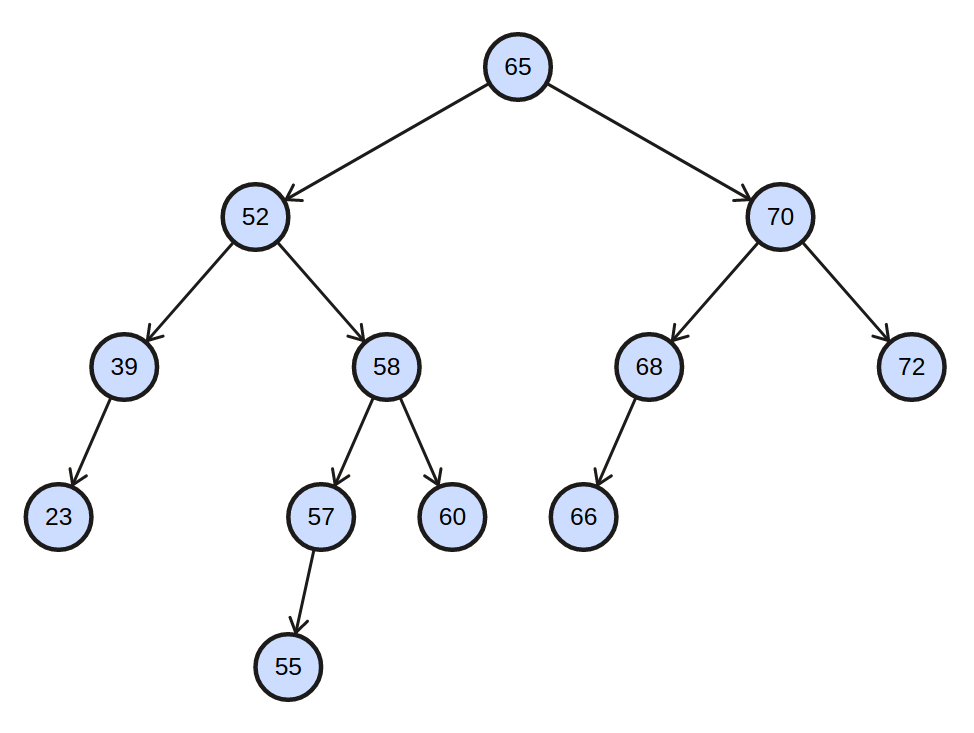
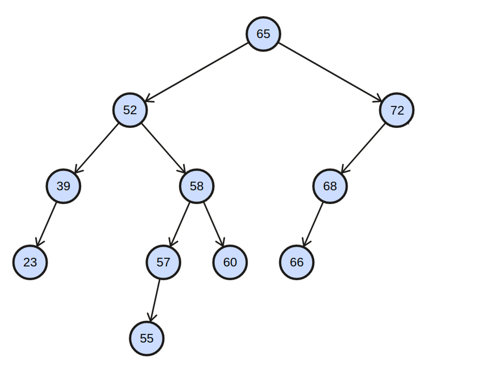
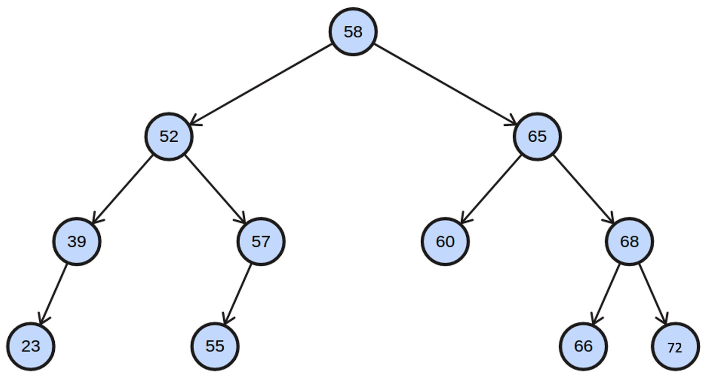
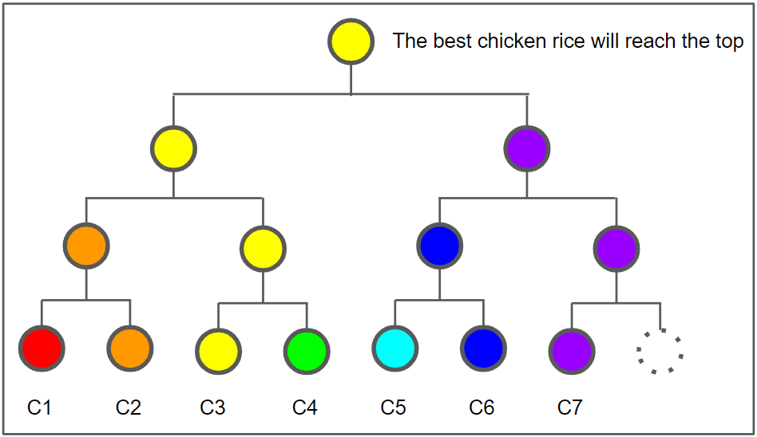
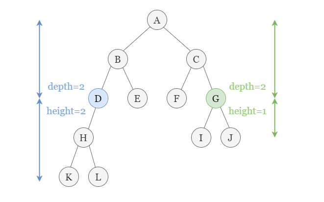
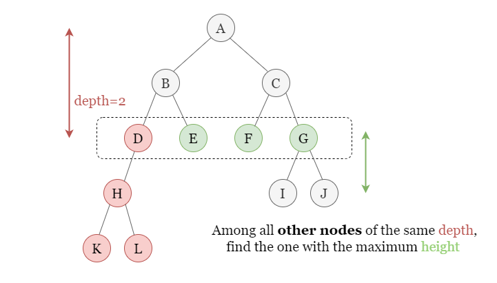

<style>
  @import url('https://fonts.googleapis.com/css2?family=Open+Sans:ital,wght@0,400;0,700;1,400;1,700&display=swap');

  section {
    font-family: 'Open Sans'
  }
</style>

# CS2040S Tutorial 4

Group T40

Week 6

---

# Picture of the Day

<div style="display: flex; gap: 30px">

<div>


</div>

<div>

Sleepy boi UwU

</div>

</div>

---

# Problem 0: Short Quiz

---

# Problem 0a

The number of rotations needed to insert a new node in AVL Tree is $\Theta(\log n)$

* False
* Height is increased by at most one. Rebalance the lowest unbalanced node will reduce the height (which is increased when inserting the new node) by one.

---

# Problem 0b

The number of rotations needed to delete a node in AVL Tree is $\Theta(1)$

* False
* Height is decreased by at most one. Rebalance is needed from the point where the node is deleted up to the root. Rebalancing will never increase the height of the unbalanced node.

---

# Problem 0c

Given a height-balanced AVL Tree. Assume the height of the tree is $h$. The number of nodes will not exceed $2^{h + 1}$. Assume that leaves have height of 0.

* True.
* In fact the maximum is $2^{h + 1} - 1$. It's a complete binary tree.

---

# Problem 0d

Given a height-balanced AVL Tree. Assume the height of the tree is $h$. The number of nodes is at least $2^{h - 3}$. Assume that leaves have height of 0.

* False
* Suppose $f(n)$ is the number of minimum node for a AVL tree of height $n$.
* Then $f(n) = f(n - 1) + f(n - 2) + 1$.
* Solving it gives $f(n) = \mathcal{O}(\phi^n)$
* It means that there exists such an AVL tree that has less than $2^{n - 3}$ nodes when $n$ is large enough.
* Refer to Tutorial 1 Problem 4e for more information

---

# Problem 1: Trees Review



---

# Problem 1a

Trace the deletion of node with key 70.

---

# Solution

* Node 70 has two children. Get the successor to replace it, i.e. 72.
* Node 65 will be the lowest node that violates the height-balanced property. It's left heavy.
* Node 52 is right heavy. Hence, we do left rotate on 52, then right rotate on 65.

---

# Solution



---

# Solution



---

# Key Concept

## Rotation

Suppose node `v` is the lowest node that violates height-balanced property. Assume that `v` is LEFT heavy.

* if `v.left` is BALANCED or LEFT heavy, do `rightRotate(v)`.
* if `v.left` is RIGHT heavy, do `leftRotate(v.left)`, then `rightRotate(v)`
* How to remember: if both heavy is in the same direction, then rotate the parent in the other direction. Otherwise, do two rotations.

---

# Key Concept

## Deletion

Suppose node `v` is to be deleted. Replace it with the successor.

* In code implementation, we have to divide it into three cases: 0 - 2 number of children.

---

# Problem 1b

Identify the roots of all maximally imbalanced subtrees in the original tree. $A$ maximal imbalanced tree is one with the minimum possible number of nodes given its height $h$.

---

# Solution

All nodes are maximally imbalanced. Refer to **Problem 0d**.

---

# Problem 1c

During lectures, we’ve learnt that we need to store and maintain height information for each AVL tree node to determine if there is a need to rebalance the AVL tree during insertion and deletion. However, if we store height as an `int`, each tree node now requires 32 extra bits. Can you think of a way to reduce the extra space required for each node to 2 bits instead?

---

# Solution

Store the height difference of two child. It's guaranteed to be either -1, 0, or 1. We can always check the unbalanced node when we go up from the inserted node.

---

# Problem 1d

Given a pre-order traversal result of a binary search tree $T$, suggest an algorithm to reconstruct the original tree $T$.

---

# Solution

* Suppose the traversal can be accessed in an array `A[]`
* Root = `A[0]`
* Find first `i` such that `A[i] > A[0]`
* Left subtree: `A[1..i-1]`, right subtree: `A[i..n-1]`
* Recurse, do the same thing

---

# Problem 2: Iterative BFS and DFS

---

# Problem 2

During lecture, we’ve learnt how to do tree traversal in various ways. For this question, we’ll focus on DFS and BFS. Since you already know how to use DFS and BFS to traverse a tree recursively, can you propose a way using non-recursive DFS and BFS to traverse a tree? Write your answer in the form of pseudocode.

---

# Solution

Use stack for DFS and use queue for BFS :)

Main idea: in DFS, node that is traversed first will proceed to traverse its neighbour on next iteration. Last-In-First-Out.

In BFS, node that is traversed first, its neighbour will not be processed on the next iteration. You will only process nodes that has been inserted before (like a queue). First-In-First-Out

---

# Problem 3: Chicken Rice

Imagine you are the judge of a chicken rice competition. You have in front of you $n$ plates of chicken rice. Your goal is to identify which plate of chicken rice is best.

---

# Problem 3a

A simple algorithm:

* Put the first plate on your table.
* Go through all the remaining plates. For each plate, taste the chicken rice on the plate, taste the chicken rice on the table, decide which is better. If the new plate is better than the one on your table, replace the plate on your table with the new plate.
* When you are done, the plate on your table is the winner!

Assume each plate begins containing n bites of chicken rice. When you are done, in the worst-case, how much chicken rice is left on the winning plate?

---

# Solution

1 :(

Worst case is when the first plate is the best, hence you have to try it with the remaining $n - 1$ plates. Then it has $n - (n - 1) = 1$ bite left.

---

# Problem 3b

We want the winning plate has as many chicken rice as possible. Design an algorithm to maximize it.

---

# Solution

Tournament Tree



---

# Solution

* Start with $n$ plates as the leaves.
* For every two chicken rice, pick one that's the best.
* After each round, number of plates is reduced by half.
* At the end,
  * You will consume $\mathcal{O}(\lg n)$ bites of the winning chicken rice.
  * You will consume $\mathcal{O}(n)$ bites in total. (Use GP, $n + n/2 + \dots$)

---

# Problem 3c

Now you want to find the median best chicken rice. Design an algorithm that maximize the remaining bites on the winning plate.

---

# Solution

QuickSelect

* In average, $\mathcal{O}(\lg n)$ pivots have to be chosen before we get the median.
* If we choose the pivot at random, at one level of recursion, the expected number of bites taken from the a chicken rice is $\frac{1}{n} \cdot n + (1 - \frac{1}{n}) \cdot 1 \leq 2$.
  * The first part is when we choose the median chicken rice as pivot.
  * The second part is the other way around.
* Hence we can expect we eat for $\mathcal{O}(2 \lg n) = \mathcal{O}(\lg n)$ bites of the median chicken rice.

---

# Problem 4: Economic Research

Given a table of three columns: `id`, `age`, `wealth`. Divide the dataset (with $n$ rows) into $k$ "equi-wealth" age ranges $A_1$, $A_2$, ..., $A_k$ that have the follwing properties:

1. All ages of people in set $A_j$ must be less than or equal to $A_{j + 1}$.
2. The sum of wealth in each set should be _roughly_ the same.

Assume that $k$ is small, but the given dataset can be very large, e.g. the population of Singapore.

Design the most efficient algorithm and analyse its time complexity.

---

# Problem 4: Economic Research

Example:

```
1 24 150,000
2 32 42,000
3 18 1,000
4 78 151,000
5 60 109,000
```

When $k = 3$, the partitions are $\{3, 1\}$, $\{2, 5\}$, $\{4\}$. Each partition has the same total wealth of $151,000$.

---

# Solution

* Let $S$ be the sum of all wealth
* **Assume** that the dataset is sorted by age
* Find breakpoints $p_1$, $p_2$, ..., $p_{k-1}$ such that the sum for interval $[0, p_1)$, $[p_1, p_2)$, ..., $[p_{k-1}, n)$ is approximately $\frac{S}{n}$
* This can be done by using QuickSelect $k$ times. Each time we choose a random pivot and partition the array based on `age`.
* Expected running time complexity: $\mathcal{O}(nk)$

---

# Better Solution

* Find all breakpoints simultaneously
* Use QuickSort-like method, where pivot splits the element into two equal sizes (not wealth!)
  * Use QuickSelect to find median
* We know for each breakpoint, which region it should recurse to.
* This runs in $\mathcal{O}(n \lg k)$

---

# Better Solution (cont.)

* Intuition: after $\mathcal{O}(\lg k)$ depth, each region is of size $n/k$
* For each breakpoint, we know which region it belongs
* We can run QuickSelect again to obtain the breakpoint
* Since each region is of size $\mathcal{O}(n/k)$ and we did it for $k - 1$ breakpoints, it runs in $\mathcal{O}(n)$ time.
* In total, we run in $\mathcal{O}(n \lg k) + \mathcal{O}(n) = \mathcal{O}(n \lg k)$

---

# Better Solution (cont.)

* Note: even if you continue the recursion (i.e. not doing QuickSelect when the region is of size $n/k$)
* Let $T(n, k)$ be the time needed to run on array of size $n$ with $k$ breakpoints to find
* $T(n, k) = T(\frac{n}{2}, k_1) + T(\frac{n}{2}, k_2) + \mathcal{O}(n) + \mathcal{O}(k)$ where $k_1 + k_2 = k$
  * $\mathcal{O}(n)$ from QuickSelect
  * $\mathcal{O}(k)$ from splitting the breakpoints to corresponding regions
* Solving this yield $\mathcal{O}(n \lg k)$

---

# Problem 5: Height of Binary Tree After Subtree Removal Queries

---

# Problem 5

* Given a rooted binary tree with $n$ nodes
* Each node has unique value assigned from 1 to $n$
* Given $m$ queries
  * The $i$-th query contains a number $x$. You should return the height of the tree after subtree removal of node $x$.
  * Each query is independent. i.e. it will not modify the existing binary tree.

---

# Solution



---

# Solution


