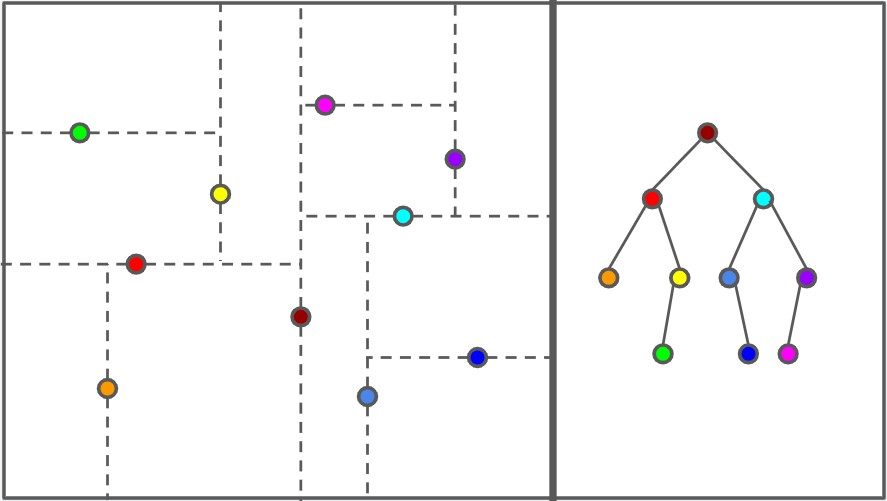

<style>
  @import url('https://fonts.googleapis.com/css2?family=Open+Sans:ital,wght@0,400;0,700;1,400;1,700&display=swap');

  section {
    font-family: 'Open Sans'
  }
</style>

# CS2040S Tutorial 5

Group T40

Week 7

---

# Picture of the Day

<div style="display: flex; gap: 30px">

<div>


</div>

<div>

UwU

</div>

---

# Problem 1: AVL vs Trie

Discuss the trade-offs using AVL and Trie to store strings

---

# Some Possible Answer(s)

* For ease of discussion, suppose that there are $N$ strings inserted into the ADT with average length of $L$. Denote $S$ be the sum of length of all inserted strings, i.e. $S = N\cdot L$.
* Memory complexity:
    * Trie: $\mathcal{O}(S)$
    * AVL Tree: $(S)$
* Time complexity for `insert`, `delete`, and `find` a string $P$:
    * Trie: $\mathcal{O}(|P|)$
    * AVL Tree: $\mathcal{O}(|P| \lg N)$

---

# Some Possible Answer(s)

* Does this mean Trie is always the best choice than AVL Tree?
* Not really. Trie has more overhead in terms of space
* Trie has more nodes than AVL Tree as each node correspond to one character
* String comparison in AVL tree can leverage on cache locality (so it's faster), i.e. the characters are stored in a contiguous memory location and loaded as a group/chunk (called cache line) into the cache.
* Trie has better support for wildcard search

---

# Problem 2: kd-Trees



---

# Problem 2 Terminology

* **Horizontal split**: splits the coordinate space into left and right, i.e. the splitting line is vertical.
* **Vertical split**: defined analogously

---

# Problem 2a

How do you search a point in kd-Tree?

---

# Solution

* If it's a horizontal split, then we determine traversal direction from `x` coordinate. Otherwise, we use `y` coordinate.
* Runtime: $\mathcal{O}(h)$, where $h$ is the height of the kd-tree.

---

# Problem 2b

Given an unordered array of points. What's the most efficient way to build a kd-Tree?

---

# Solution

* Similar to QuickSort algorithm by picking random values in the array as pivot. We split into two subproblems and recurse to both sides.
* Expected runtime: $\mathcal{O}(n \lg n)$

---

# Problem 2c

How would you find a point with the minimum (or maximum) x-coordinate in a kd-Tree? How expensive can it be if the tree is perfectly balanced?

---

# Solution

* We're only interested in nodes that are horizontal split.
* Suppose that our `x` value is `<=` the pivot, we recurse left. Otherwise, right
* Notice that the children of horizontal split is vertical split. We cannot infer any information from it. We recurse one more depth further on **both** children.
* We will check the constraint on the next two horizontal splitting nodes. Node that we have to recurse on both sides!

---

# Solution

* Let $T(n)$ be the time complexity to run such query with $n$ nodes.
* $T(n) = 2 \cdot T(\frac{n}{4}) + \mathcal{O}(1)$
* Solving it yields $T(n) = \mathcal{O}(\sqrt n)$
* Meth details:
    * Let $n = 4^k$. Then $T(4^k) = 2 \cdot T(4^{k - 1}) + \mathcal{O}(1)$
    * $T(n) = 2^k + 2^{k - 1} + ... + 1$
    * $T(n) = 2^{k + 1} - 1 = 2 \cdot 4^{k/2} = 2 \cdot n^{1/2} = \mathcal{O}(\sqrt n)$
* Note: you can draw out the recursion tree

---

# Problem 3: Tries (a.k.a. Radix Trees)

---

# Problem 3

Design an efficient data structure that supports the following operations:

* `insert(name, gender, count)`: adds a baby name with the given gender, with the number of babies having that name.
* `countName(name, gender)`: returns number of babies that have the given name and gender.
* `countPrefix(prefix, gender)`: returns number of babies that have the given prefix and gender
* `countBetween(begin, end, gender)`: returns number of babies with that prefix of the given name and gender

---

# Solution

* Use two Tries, each for one gender
* Each Trie's node will store the following:
    * Array of `Node` for next `Node`'s children
    * `count`, the number of babies with such prefix
    * `countName`, the number of babies with such name
* `node.count` = `sumCount(node.children)`
* The first tree queries should be straightforward
* How about `countBetween`?

---

# Prefix Sum

* Given an array of `n` integers `A[]`.
* Prefix sum `P[]`, which is array of integers, is defined as:
    * `P[i] = sum(A[0..i])`
* Query: find the sum of integers from index `l` to `r`.
    * `P[r] - P[l - 1]`

---

# `countBetween`

* Use similar ideas, i.e. we find the number of names that is lexicographically *smaller or equal* to the name
* We can just substract the two

---

# `countBetween`

* Suppose we are at some node `node` and will traverse to the child `child` when traversing.
* All children of `node` that is to the left of `child` will be *lexicographically smaller* than the name.
    * They have the same prefix up to `node`
    * If the next letter is smaller than our `name`'s next letter, then it must be smaller

---

# Pseudocode

```java
int countSmaller(String name, boolean isStrict) {
    int curIndex = 0;

    int retValue = 0;

    Node node = this.root;
    while (node != null && curIndex < name.length()) {
        // We assume the child traversal in root.children
        // is in ascending order
        for (Node child: node.children) {
            if (child.letter == name[curIndex]) {
                node = child;
                break;
            }
            retValue += child.count;
        }

        curIndex++;
    }

    // Assuming we also want the same string, we add it
    if (!isStrict && node.isName) {
        retValue += node.countName;
    }

    return retValue;
}
```

---

# Pseudocode

```java
int countBetween(String begin, String end) {
    return countSmaller(end, false) - countSmaller(begin, true);
}
```

---

# Problem 4: A Trie Question?

---

# Problem 4a

Given an array of 32 bits unsigned positive integers, find 2 numbers such that their XOR is maximum.

---

# Hints

1. Look at the title of the question
2. Think of numbers bit by bit from the most significant bit

---

# Solution

* Use Trie :)
* Start storing from the most significant bit to least significant bit
* Use two pointers, starting from root
* If it's possible for the two pointers go to different bit, do so
* Greedy solution -- always work :)

---

# Problem 4b (Optional)

Given an array of 32-bit unsigned positive integers $A$. Find a subarray $A[l..r]$ that maximises:

$$
A_l \oplus A_{l + 1} \oplus \dots \oplus A_r \oplus \max\{A_l, \dots, A_r\}
$$

---

# Solution

See tutorial solution :)

---

# Midterm PYP Discussion
